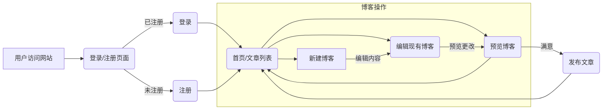

```mermaid
graph LR
    A[用户访问网站] --> B(登录/注册页面)
    B -->|已注册| C(登录)
    B -->|未注册| D(注册)
    C --> E(首页/文章列表)
    D --> E
    subgraph 博客操作
        E --> F[新建博客]
        E --> G(编辑现有博客)
        E --> H(预览博客)
    end
    F -->|编辑内容| G
    G -->|预览更改| H
    H -->|满意| I(发布文章)
    I --> E
    H --> E
```
